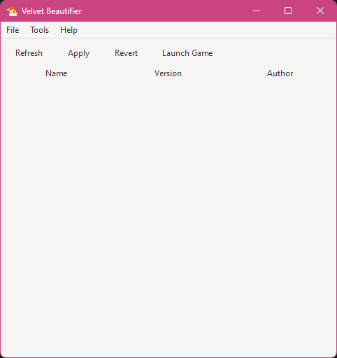

# Graphical User Interface

the executable is called `VelvetBeautifier.GUI.<Operating-System>` (for example on Windows it's called `VelvetBeautifier.GUI.Windows.exe`)

## First time usage

When you launch the executable for the first time, it will take some time to setup some. In some cases you might get a error message and there two of them:

- `OldConfig`: your `config.json` cannot be used because it was used by a older version of the tool, make a backup (or not), delete it and let the program run again
- `BackupFailed`: you've already modified your game files without this tool, redownload the game files should fix it

After the setup you should be greeted by something like this:

## Usage

### Content

The main content is the mod list, it will show you the mods you have installed currently and on the top are some buttons that allow you to do various things:

- `Refresh`: refreshes the mod list
- `Apply`: applies the mods and thus modifiying the game
- `Revert`: removes all the mods from the game (basically makes it vanilla)
- `Launch Game`: applies the mods and launches the game

You can also drag & drop files/folders/urls into the list to install mods

### Menu Bar (the top thing)

- `File`: just contains options that act the same way as the buttons
- `Tools`: contains functions to extract/create files (`.gfs`/`.tfhres`) and mod creation
- `Help`: the usual things like reporting a issue, feature request and the about page

### Command Line

the executable can also be operated with the command line, [see here how it works](./CLI.md)
