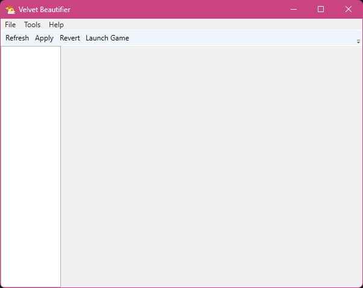
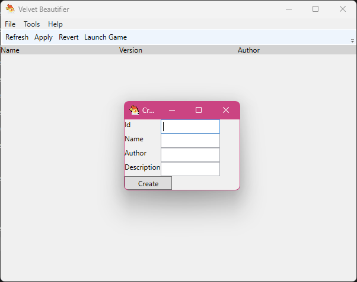

# Guide

## How create a mod

### The `GUI` way

1. Launch `VelvetBeautifier.GUI`, it should look something like this:
    
2. Click on `Tools -> Create new mod` or just press `Ctrl + N` on your keyboard, you should see this:
    
3. Fill out the information, click on `Create` and confirm the message box by clicking on `Ok`
4. Your mod should be then on the modlist view
5. You can right click on your mod and then `Open Folder` to open the location of the mod

### The `CLI` way

1. Open up a Terminal where `VelvetBeautifier.CLI` is located
2. Type this command in:

    ```shell
    VelvetBeautifier.CLI --create <mod-id> # replace mod-id with your unique mod identifier
    ```

3. A new folder in `mods` should be called `<mod-id>`

### The manual way

1. Create a folder in the `mods` folder (name it whatever you want)
2. Create a `mod.json` file and fill it with the required information:

    ```json
    {
        "id": "ntf.test.mod", // best id is always com.<your-name>.<mod-name>
        "name": "Test Mod", // Humanreadable name
        "author": "Night The Fox", // Your name
        "desc": "This is a Test Mod", // Some details about the mod (what it adds/changes etc)
        "version": "1.0.0", // it should be always <major>.<minor>.<patch>
        "url": "https://somelink.to/the/mod" // link to your mod download (GameBanana, direct zip download)
    }
    ```

## How to mod stuff

When `<root>` is mentioned, it means your mod folder (`mods/<your-mod-folder>/`)

### Reverge Package files (`*.gfs`)

You can modify the following Reverge Packages:

- `ai-libs.gfs` - contains lua code for AI, wouldn't touch it for now
- `characters-*.gfs` - contains character data, wouldn't touch it for now
- `dev.gfs` - contains some various stuff, don't have a reason to modify this
- `levels.gfs` - contains all the stage data during a fight and some story mode sections, I wouldn't modify this because it's better to create a [Level Pack](#level-packs) instead
- `nidra-baihe-texas-art-pt.gfs` - I don't know why this is a seperate thing but the same thing applies to `characters-*.gfs`
- `sprites.gfs` - contains sprite data of some effect used during a fight
- `trials.gfs` - contains scripted cutscenes used in Training and Story Mode (like with the snake boss)
- `ui*.gfs` - contains OtterUI scenes, currently there are no tools to modify them

To modify one of these files you create a folder with the same name as the file (for example to mod `dev.gfs` you create a folder named `<root>/dev.gfs/`). To change something inside the gfs file just copy the path of the file inside the gfs into there and make your changes (for example to modify `dev.gfs/temp/config/foit_files.ini` you create `<root>/def.gfs/temp/config/foit_files.ini`)

### TFH Resource files `.tfhres`

You can modify the following TFH Resource files:

- `arizonaopening_prod.tfhres` - contains entries to Chapter 1 Part 1 opening with Texas and Arizona
- `canyon_prod.tfhres` - contains entries to Chapter 1 Part 1 Canyon section
- `highlands_prod.tfhres` - contains entries to Chapter 1 Part 3/4 "At the mountains of Sadness" and "Temple of Gloom" sections
- `inttests_prod.tfhres`, `testroomd_prod.tfhres` - contains testing maps for various unit testing or just testing, not used by the game (but has some cool stuff to look at)
- `lobbymaps_prod.tfhres` - contains entries to Pixel Lobbies (map data)
- `prologue_prod.tfhres` - contains entries to Chapter 1 Part 0 Prologue
- `reine_prod.tfhres` - contains entries to Chapter 1 Part 2 Reine
- `resources_prod.tfhres` - contains a lot of different kind of entries, here you can find the relations to Pixel Lobby sections (which one to load, etc.)

TFH Resource files are just SQL databases so you can use any SQL client to make changes. For people that don't want to mess with SQL (which is understandable) they can use [DB Browser for SQLite](https://sqlitebrowser.org/). Just like with Reverge Package files to change something it has to be the same primary key (that is `hiberlite_id`)

### Level Packs

To not cause issues with `levels.gfs` mods, I've created something called **Level Packs**, a level pack contains entries to your stages and their data, when mods are applied, all level packs get merged into one and written to `levels.gfs`. A valid level pack rests inside `<root>/levels/`, more information can be found [here](https://github.com/ThemModdingHerds/levels/blob/main/Levels/README.md#level-packs)
